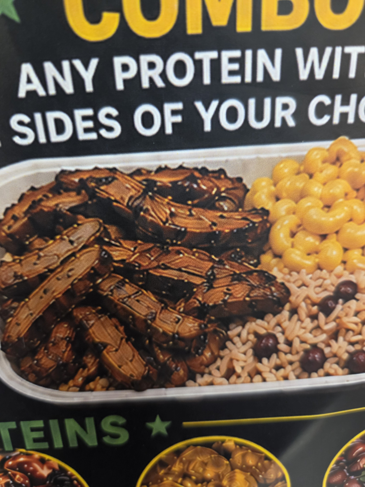
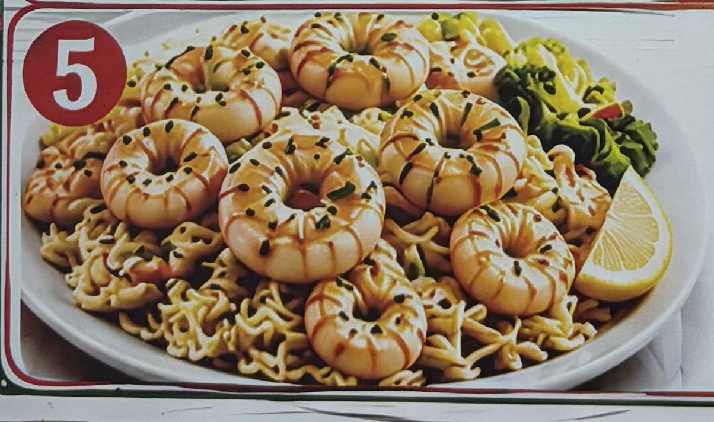
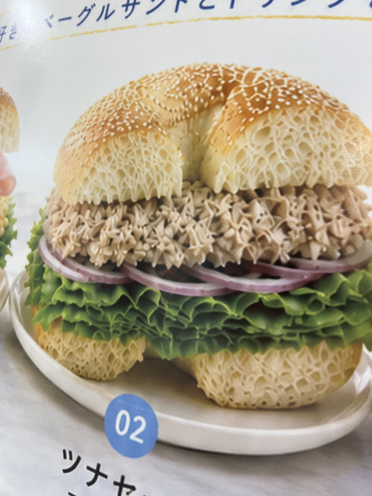
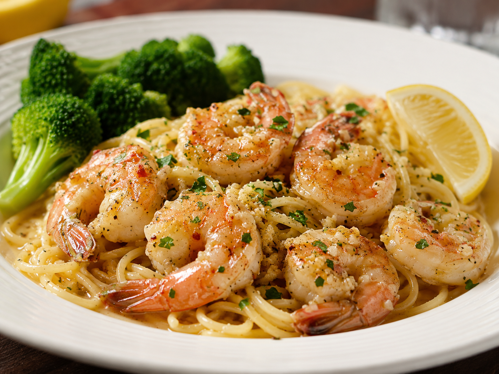

I need to vent about something. I've been seeing so many posts lately with menu images from restaurants. Specifically, AI-generated menu images that look absolutely
disgusting. Three typical examples are shown below.

::: {layout-ncol=3}
{#fig-protein}

{#fig-scampi}

{#fig-bagel}
:::

- Restaurants have taken pictures of their own food, since the technology to do so has existed. It's easy to do since they make the food 
anyway, and now that everyone has a high-quality camera in their pocket, this has never been easier.
- Even if you don't want to do that, here's the thing. LLMs can now render images of food that actually looks appetizing, very quickly. 
Below is an image I generated with ChatGPT using the prompt *"Give me an image for my restaurant menu of a delicious shrimp scampi. 
Include spaghetti, broccoli and a lemon wedge."* Doesn't that look a lot more appetizing than something that seems like I'll be eating 
bugs or worse?

{#fig-better width=50%}

- I just need to know why so many restaurants are using these menu pictures that immediately make me lose my appetite when they have so many
reasons not to do so. Any theories? 