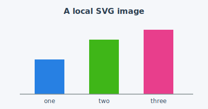

A live reference for writing entries. Everything below is rendered from the
source of this very file — view the page and the source side by side.

## 1. Front matter

The block between `---` at the top configures the page. The fields I use most:

```yaml
---
title: "Beating the baseline on Titanic"
description: "A quick feature-engineering pass."   # shows in the listing
date: "2026-06-27"                                 # drives sort order
categories: [kaggle, xgboost]                      # filterable tags
image: thumbnail.png                               # listing thumbnail
draft: true                                        # hide until ready
---
```

`author` and `toc` come from `posts/_metadata.yml`, so they don't need
repeating here. Anything set in a post overrides that shared default.

## 2. Prose

Standard markdown: **bold**, *italic*, `inline code`, [links](https://quarto.org),
lists, and tables.

| Feature      | Works? |
|--------------|:------:|
| Tables       |   ✅   |
| Footnotes    |   ✅   |

Math renders natively — inline $E = mc^2$ and display:

$$\text{logloss} = -\frac{1}{N}\sum_{i=1}^{N} \big[y_i \log p_i + (1-y_i)\log(1-p_i)\big]$$

## 3. Callouts

::: {.callout-note}
Use callouts for asides. Variants: `note`, `tip`, `warning`, `important`, `caution`.
:::

::: {.callout-tip collapse="true"}
## Click to expand
Add `collapse="true"` to make a callout foldable.
:::

## 4. Images

A local image lives in the post folder and is referenced relatively. The
`{#fig-...}` label makes it cross-referenceable:

{#fig-demo width=70%}

As @fig-demo shows, you can reference a figure by label and Quarto numbers it
for you.

## 5. Executable code

A cell with `{python}` (curly braces) runs at render time; its output is
embedded. The `#|` lines are cell options.

```{python}
#| label: fig-dist
#| fig-cap: "A plot generated at render time"
#| code-fold: true
import matplotlib.pyplot as plt

plt.figure(figsize=(5, 3))
plt.bar(["one", "two", "three"], [70, 110, 130],
        color=["#2780e3", "#3fb618", "#e83e8c"])
plt.title("Generated by Python")
plt.tight_layout()
plt.show()
```

Useful cell options: `echo: false` (hide code, show output), `eval: false`
(show code, don't run), `output: false` (run, hide output), `code-fold: true`
(collapsible).

To show a code cell *without running it* (for teaching), set `eval: false`:

```{python}
#| eval: false
# This block is displayed but not executed.
import pandas as pd
df = pd.read_csv("train.csv")
df.head()
```

## 6. How rendering works here

Push to `main` → the GitHub Action runs `quarto render` (installing Python so
the cells above execute) → the built site deploys to Pages. With `freeze: auto`
(set in `posts/_metadata.yml`), a post only re-executes when its own source
changes.
