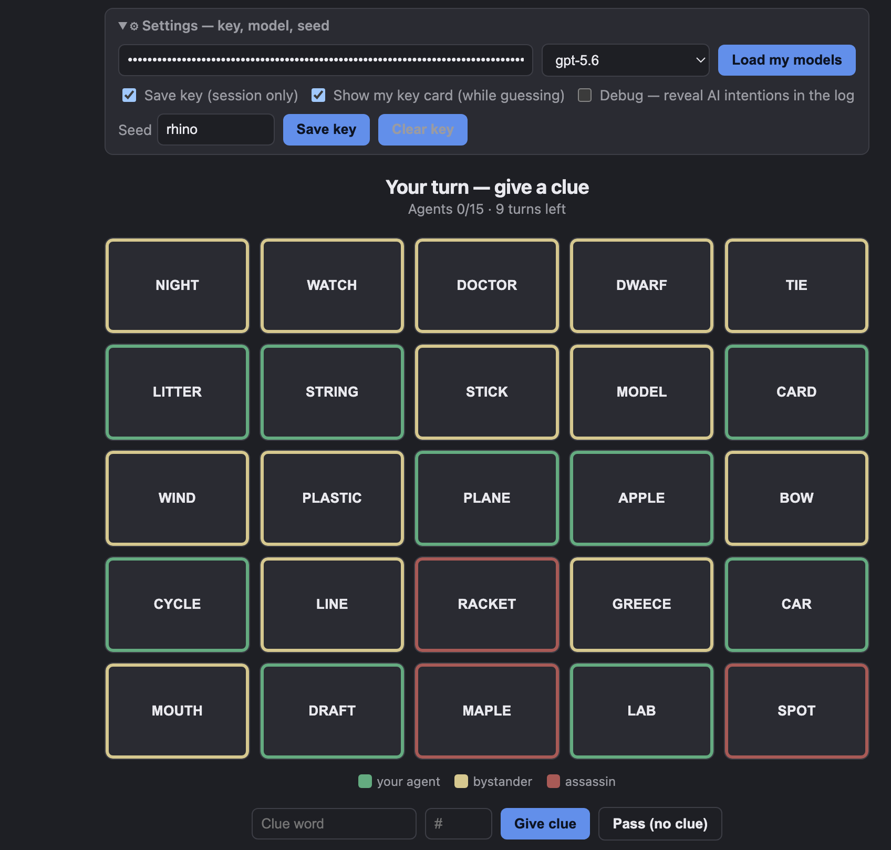
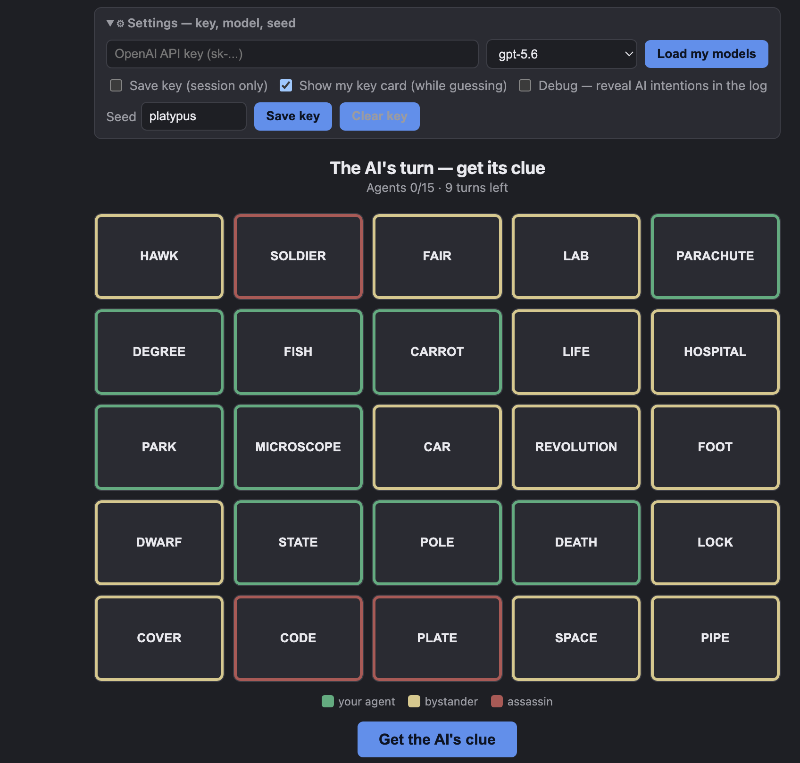

## Play it

[**Open the game →**](app/index.html) — bring your own OpenAI API key. It stays in
your browser and is sent directly to OpenAI; it never touches a server of mine.

## What this is
- [Codenames Duet](https://en.wikipedia.org/wiki/Codenames_(board_game)#Duet) is a two-player, co-operative variation of the popular
board game, Codenames. 
- In the game, there is a 5x5 grid of word cards. Each player also sees a hidden 5x5 key-card, specifying
if each location is an agent (green), a bystander (beige), or an assassin (black). The goal of the game is to take alternating
turns with your partner, giving each other clues, and trying to find all 15 of your agents together before the shared 9 turn timer runs out.
Once all agents on one player's key card have been found, the other player gives every remaining clue.
- A clue is given by saying a number and a word. For example, if I want you to guess "Monkey", "Elephant" and "Zebra", I can say "3 Animal".
- After a clue is given, the partner starts guessing. Finding an agent lets them continue, touching a bystander immediately ends the turn,
and touching an assassin immediately loses the game. My implementation currently caps guessing at $N+1$ words for a clue numbered $N$,
and allows the guesser to stop at any time.
- If after all turns are used, there are still agents remaining, the game enters a sudden-death phase. Players may discuss a 
guessing strategy, and then guess words in any order according to their strategy. Getting all the greens results in a win,
while getting anything else results in a loss.
- Because of the key-card asymmetry, it's possible that a bystander for me might be an agent for my partner, so I may want to guess that word
in the future (therefore it's not covered up upon a bystander guess).
- There are some reasonable guidelines about what kind of clues are allowed - it must be one word, and it cannot be part of one of the 
other words visible on the table.
- It's a fun game to play but my wife is sometimes too busy for a game! So I thought playing with an LLM would be a reasonable way to
get practice, and still have fun. It also gives me the chance to learn some of the basics about putting an LLM into production.
- As the clue-giver, the LLM sees its own key card and has to describe its agents while trying to not touch a bystander or assassin. As
the guesser, the LLM sees your clue and the board, and has to infer what you meant.

## Interfacing with the LLM
- I've decided to have players bring their own API key for simplicity. Requests go directly from the browser to OpenAI, so the key
never passes through a server of mine. If you choose to remember it, the app stores it in the browser's `sessionStorage`.
I've also limited things to OpenAI for simplicity.
- The model picker uses model-name filters to select families expected to support
[Structured Outputs](https://developers.openai.com/api/docs/guides/structured-outputs), so compatibility is best-effort.
Structured Outputs constrains the response to our JSON schema, but we still need to handle refusals, incomplete responses,
and responses whose contents violate the game rules.
- The calls to the API all look roughly like this

```JavaScript
client.chat.completions.parse({
  model: selectedModel,
  messages: [
    { role: "system", content: instructions },
    { role: "user", content: currentGameInformation }
  ],
  response_format: zodResponseFormat(responseSchema, responseName),
  max_completion_tokens: 8192
});

```
- In general, the "system" role is to set the context, tone, rules and boundaries of the LLM's response, while the "user" role
submits the immediate task.
- Each `instructions` string starts with the rules, which also convey the goals of the game.
```JavaScript
const RULES = `You are an expert cooperative partner in Codenames Duet.
You and your human partner each hold a DIFFERENT key card. You win together by
contacting all 15 agents (the union of both cards) before the shared turn timer runs out.
Two dangers: guessing a BYSTANDER ends the turn; guessing an ASSASSIN loses the game instantly.
If the timer runs out with agents still hidden, no more clues can be given — you both
make final guesses from the clues already given (sudden death), where a single wrong
guess loses. So use each clue turn to convey as much as you safely can while it lasts.`;
```
- The `instructions` for the clue giver role continues with 
```JavaScript
export const CLUE_SYSTEM = `${RULES}

Your job now: give ONE single-word clue and a NUMBER for the agents you want your
partner to guess. Rules for a legal clue:
- exactly one word, no spaces or hyphens;
- must NOT be any word on the board, nor contained in one, nor contain one
  (e.g. do NOT clue "HERO" if SUPERHERO is on the board);
- must NOT be another form of a board word (e.g. do NOT clue "PIRACY" if PIRATE
  is on the board);
- the NUMBER must equal how many target words you list.

Strategy: you will be told which remaining words are your AGENTS, your ASSASSINS,
and your BYSTANDERS. Prefer familiar meanings and direct associations your partner
can recognise from the clue alone — not elaborate links that only make sense once
explained. Before committing, weigh every assassin and bystander against your clue:
if your partner could plausibly read the clue as pointing at one of them, or it fits
one as well as your agents, choose a safer clue. An assassin match is fatal and
outweighs any number of agents, so when a clue is even somewhat risky, cluing fewer
agents — or a different pair — is usually better. In "reasoning", briefly note the
main associations and any competing dangerous words, then commit to "clue", "number",
"targets".

Plan for the whole game, not just this turn. You have a limited number of clue turns
to get EVERY one of your agents found, so weigh safety against coverage: group several
agents under one clue when you can, and don't keep deferring a hard, isolated agent —
if the timer runs out with an agent that was never clued, your partner has no way to
find it. Near the end especially, before settling for a safe single-agent clue, check
whether another agent would then be left with no clue at all; a broader clue may be
worth the risk to avoid stranding it.

Example — board has APPLE, ORANGE, BANANA, KING; your agents are APPLE and ORANGE, and
BANANA is your ASSASSIN. "FRUIT" for 2 is tempting, but BANANA is just as much a fruit — a
fatal match. Better: find a clue that fits BOTH agents yet clearly not BANANA — APPLE and
ORANGE are round while a banana is long and curved, so "SPHERICAL" for 2 keeps both agents
and dodges the assassin. Only if no such separating clue exists should you retreat to a
safe single like "CIDER" for 1 (APPLE alone) — cluing fewer still beats risking the
assassin. Good answer: reasoning "SPHERICAL fits round APPLE and ORANGE, and a banana is
plainly not round, so my partner won't reach for BANANA", clue "SPHERICAL", number 2,
targets ["APPLE","ORANGE"].`;
```

- The `instructions` for the clue guesser role continues with 
```JavaScript
export const GUESS_SYSTEM = `${RULES}

Your job now: your partner gave a one-word clue and a number. Choose which words on
the board they most likely mean, RANKED best-first. You do NOT see any key card —
infer from the clues.

Reading the history: each player has a different key card, and every outcome shown
refers to the card of whoever GAVE that clue. Your guesses this turn are judged
against your PARTNER's card — so look for leftover agents among your PARTNER's earlier
clues, never your own (your own clues described YOUR card). A word that ended a turn
as a bystander for one of you may still be an agent on the other card. Only 9 of the
25 words are agents on your partner's card; the other 16 are bystanders or assassins
(3 of them fatal), so an unclued word is far more likely to be a miss — guess only
what the clues actually support.

In "reasoning", briefly explain the main associations and any competing words, then
list "guesses" (exact board words).

How many to guess:
- The number is how many words THIS clue points to. Guess those, most-confident first.
- You may make ONE extra "bonus" guess (number+1 total), but ONLY for an agent you are
  confident your PARTNER pointed at in an EARLIER clue and left unfound — never to
  gamble on a loose association with the current clue.
- If you have no such confident leftover, STOP after the clue's number.
- A wrong guess ends the turn, and the assassin loses the game outright — so caution
  beats greed. When unsure, guess fewer.`;
  ```
- For the clue giver, the `currentGameInformation` will look something like this.
The turn count is the team's shared timer; the two agent counts describe the clue-giver's remaining agents and the total still needed to win.
```Markdown
Words still in play: [remaining board words]

Your agents ([agent count] left to get your partner to find, in ~[turn count] clue turns) — each is +1 toward the 15: [agents]
ASSASSINS on YOUR key card — [assassins]. A touch here loses the game instantly; reject any clue your partner
could plausibly read as pointing at one.
BYSTANDERS on YOUR key card — [bystanders]. A touch here ends the turn with nothing found;
avoid clues that fit one as well as your agents.
Turns remaining (shared timer): [turn count]. Agents still to find in total: [total remaining agents].
Make sure every one of your agents gets a clue before time runs out.

Game so far:
[formatted history]

Give your clue now.
```
- The formatted history in the above will look something like this.
```Markdown
human clued "OCEAN" 2 -> WHALE=green, SHIP=bystander
```
- For the clue guesser role, the `currentGameInformation` will look something like this.
The bystander reminder is included only when earlier guesses have identified bystanders on the card currently being guessed against.
```Markdown
Words still in play: [remaining board words]

Your partner's clue: "FRUIT" for 2.
Already shown to be BYSTANDERS on the card you're guessing against — they CANNOT be agents here, so never guess them again: [known bystanders]
Turns remaining: [turn count]

Game so far:
[formatted history]

Make your guesses now: up to 2 for this clue, best-first —
plus a 3rd bonus guess ONLY if you're confident about an agent left over from an earlier clue.
```

- `zodResponseFormat` is a function supplied by the OpenAI SDK. It converts our Zod schema into the JSON Schema response format
sent to OpenAI. Using it with `chat.completions.parse()` also lets the SDK parse and validate the returned JSON against that schema.
For clue-giving, the schema requires reasoning, the clue, the number and the targets.

```JavaScript
const ClueSchema = z.object({
  reasoning: z.string(),          // Text explaining the choice
  clue: z.string(),               // The clue, as text
  number: z.number().int(),       // An integer
  targets: z.array(z.string()),   // A list of text strings
});

// ...and pass it to the API call as the response format:
response_format: zodResponseFormat(ClueSchema, "clue")
```

- For clue guessing, we extract the guesses and the reasoning.
```JavaScript
const GuessSchema = z.object({
  reasoning: z.string(),
  guesses: z.array(z.string()),
});
```

- When sudden death begins, we ask the AI once for a ranked list of remaining guesses, each with a confidence score from 0 to 1.
We reuse that list for subsequent AI guesses, skipping words already found. The human can make their own guess or ask the AI to make
its next ranked guess after seeing its confidence score. These scores are the model's own estimates: the code clamps them to 0–1,
but they have not been calibrated against actual success rates. The idea is to mimic the strategy discussion that the rules allow for.

```JavaScript
export const SuddenDeathSchema = z.object({
  reasoning: z.string(),
  guesses: z.array(z.object({
    word: z.string(),
    confidence: z.number()
  }))
});
```

## Validating the LLM Response

- We still have to check that the AI gave a valid response when giving a clue. The clue must be non-empty and contain no whitespace or hyphens.
It cannot equal a board word, contain a board word, or be contained in one. This check includes all 25 original board words, even covered ones.
The clue's number must equal the number of targets, the targets must be distinct, and every target must be an uncovered agent on the current
clue-giver's key card. In the browser game, this is the AI's card; in self-play, it depends on whose turn it is to give a clue.
- If the clue passes validation, then it is passed on to the human. If it fails, the LLM gets a message saying
that the response was illegal, for what reason, and to try again. If it fails three total times, the turn is passed.
- It's worth noting that we are using a simplified version of the validation process. HERO when SUPERHERO is on the board is invalid,
but MAN when GERMANY is on the board is totally valid, so our substring approach is technically too rigid. An approach using lemmatization
to establish word relationships, and escalating to an LLM referee when a verdict cannot be made might be a reasonable future approach.
- The prompt also tells the AI not to use another form of a board word, such as PIRACY when PIRATE is on the board.
Our validator does not detect those relationships, so that restriction currently relies on the AI following the instruction.
- For AI guesses, we normalize the returned words, remove unavailable words and duplicates, and exclude words already confirmed as
bystanders on the key card currently being guessed against. A bystander on the other player's card remains a possible guess.
We then apply the remaining guesses in order, stopping when the turn or game ends.


## Running evals to calibrate the prompts

- After ensuring that the API calls were working, it was time to check whether or not the AI could actually play well. 
- Essentially, this is kind of a new type of "debugging", where we are assessing if the prompts we've given the AI are sufficient
for it to actually achieve its goals. Can two AIs actually play the game together and win before the timer runs out?
- I wrote a self-play evaluation script that lets AI control both players, using the same game engine, prompts and validation code as the
browser version. The intended targets and the clue-giver's explanation are recorded for debugging and analysis, but aren't actually
passed in to the guesser. 
- The script lets me choose the clue-giving and guessing models separately. A seed can be passed in to run the same game for consistency, 
although it by no means fixes the LLM's responses.
- For example, I can run:

```bash
export OPENAI_API_KEY="your-key"
EVAL_LOG=1 \
OPENAI_EVAL_CLUE_MODEL=gpt-4.1 \
OPENAI_EVAL_GUESS_MODEL=gpt-5.6 \
OPENAI_EVAL_SEED=MYSEED \
npm run eval -- 10 | tee /tmp/codenames-verification-trace.log
```
- The evaluation log reports wins, agents found, assassin hits, turns used, rejected clue attempts, and how often games reach sudden death.
- For simplicity, the evaluator currently stops when sudden death begins, so its win rate measures wins during normal play.
- Initially, we went through a few passes with cheap models, which were always losing initially. This helped find some bugs in the structure
of the logic of the self-play, and what information was being passed into the prompt. These bugs led to lots of wasted guesses, but were
solved fairly quickly.
- After these were fixed, we bumped up to 
GPT-5.6 for both roles to see how well things were going with a stronger model. What I found here was that the agents were
giving solid clues, and not hitting the assassins, but it also wasn't winning the games. In some cases, some of the words on the board 
were never even targeted. This told me the agents weren't being strategic enough in their planning.
- I added a reminder to plan across the remaining turns, group agents where possible, and avoid repeatedly postponing difficult words.
 I also made the remaining-agent counts explicit in the clue-giver’s input. After this change, the agents were able to win 3/3 boards,
 while previously just winning 1/3.
- I then ran 10 evals on a new seed, and the AIs won 9 out of ten games, with the last game reaching sudden death. A pretty solid achievement
I would say. Now this isn't enough to statistically establish just how good the agents are, or how this depends on model, but these
evals can start to get pricey, and I'm now satisfied that my goal of having a competent AI to play with has been satisfied. Or at least
as satisfied as I can be from watching AIs engage in self-play.

## Testing a couple games end-to-end

- The above shows me that the agents can competently play with each other, but how does a game with a human go? Can they interpret
human clues properly, and give clues that humans can understand? The clues given in the eval logs looked solid, but let's step into 
a couple games and see.

### Game 1:

- Seed: `rhino`
- Model: GPT-5.6 sol
- Immediately I see a solid line with *plane*, *cycle* and *car* all being different modes of transportation. I give **transportation 3**,
and the AI gets them. 3/15
- The AI gives me *prototype 2*. My thoughts are you build a prototype in a lab, and a draft could be an iteration in the same way a
prototype does. *Draft* is correct but *lab* is a bystander. 4/15
- I now have *litter*, *string*, *card*, *apple* and *lab* as my remaining clues. I try **kitten 2** as they are born in a litter and like
to play with string. The AI gets both right. 6/15
- The AI gives me **regression 2**. Well a linear regression is a *line* and it is also a data *model*, so I guess both of those. I suspect
model was the remaining idea for **prototype**, so I stop guessing. 8/15
- With *apple*, *card* and *lab* as my remaining three. I try **Newton 2**, to try to get the association with apple, and being a scientist
working in a lab. The AI gets both right! 10/15
- They give the clue **surgeon 2**. *doctor* is an obvious one and *plastic* fits with the the idea of a plastic surgeon. Both are right! 12/15
- I just have *card* left, so I give **1 deck**. 13/15
- The AI gives **acer 1**. I actually had to look up that **acer** is the genus of the maple tree. Surely something 
like **syrup** or **canada** would have been better here? 14/15
- Finally, the AI gives **bedtime 1**, a totally reasonable clue for *night*. Win!
- Worth noting that based on my API token usage, this game cost about $0.10.

{#fig-game1}

### Game 1.1:
- Seed: `rhino`
- Model: GPT-4.1
- I wanted to play the same game back with a different (older, cheaper) model, to see if there were any noticeable differences.
- **transportation 3** hits all three again. 3/15
- The AI now gives me **kit 2** as the second clue. With hindsight, I suspect that the association it was is *model* and *plastic*. 5/15
- I give **kitten 2** again, and it guesses *litter* and *string* again. 7/15
- The AI gives me **shift 3** this time. *Night* shift totally makes sense. *Stick* shift is also a thing. *Stick* is a bystander, so we're now at 8/15.
- I go back to **Newton 2**, and the AI gets them. 10/15
- The AI gives me **Sketch 2** this time. I suppose that's a *draft* with lines. 12/15.
- **Deck 1** exhausts my agents. 13/15
- The AI gives **syrup 2**. *Maple* is obvious, but now I have a previous clue relating to `shift` as well. Without hindsight I'm not sure it would be
obvious that *doctor* was the remaining agent, closing out the victory.
- Based on API token usage, this game cost about $0.02.
- It does really seem like GPT-5.6 gave stronger, more specific clues, though also their *acer* clue could have been less esoteric.

### Game 2:
- Seed: `platypus`
- Model: GPT-5.6 sol 
- This time the AI gives the first clue, and it is **sole 2**. *fish* and *foot* seem like great candidates. 2/15
- I try **hiking 2** to connect *pole* and *park*, and the AI catches on. 4/15
- The AI gives **obituary 2** as its second clue. Interesting clue - it's obviously about a death, but it's also a recap of the person's life.
I try *death*, then *life*, both correct as agents. 6/15
- *degree*, *parachute*, *carrot*, *microscope* and *state* are my remaining 5 agents. I try **thermodynamics 2** to 
associate *state* and *degree*, and, a bit to my surprise, the AI gets it right. 8/15
- The AI gives **ethics 2** as its third clue. *code* and *fair* both clearly fit the bill. 10/15
- I just give **skydiving 1** as a clue to get parachute, as I can't think of anything to connect *carrot* to *microscope* without also hitting
*lab*. 11/15
- The AI gives me **jacket 1** as its next clue. It takes me a while to figure it out, but I suppose a book jacket is its cover. 12/15
- With 2 turns left, I need to connect *carrot* and *microscope*. I try **botany 2** and it works out perfectly. 14/15
- The AI gives me **bunsen 1** as its last clue for *lab*. Another win! 

{#fig-game2}


### Game 2.1
- Seed: `platypus`
- Model GPT5.6 luna 
- Wanted to do another re-do game, but this time with a different lightweight model comparison.
- I still get **sole 2** as the first clue. 2/15
- **hiking 2** still connects *pole* and *park*. 4/15
- Our first divergence - I now get **mortality 2** as the clue connecting life and death. Equally valid in my opinion. 6/15
- **thermodynamics 2** still hits *state* and *degree*. 8/15
- Instead of **ethics 2**, we now get **computer 2** as the next clue, connecting *lab* and *code*. 10/15
- I now do **biology 2** to connect *carrot* and *microscope*, with *lab* off the board. 12/15
- The AI gives me **book 2** as its next clue, a great choice to connect *fair* and *cover*. 14/15
- **Skydiving 1** then seals the game.
- We see some differences between sol and luna, but they both gave solid clues. Luna came out to about half the price.

## Conclusions
- This was a fun project! I learned lots of things about putting an LLM into production, setting up and debugging evals, writing good prompts
and model cost/performance trade-off. Hope you play a game!