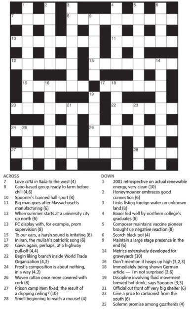
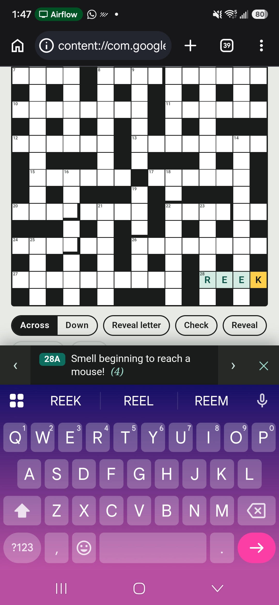

I really like this example, because it showcases a simple but practical use of AI in my everyday life,
and I actually got a very beautiful solution that I wouldn't have found without the use of AI. Every week, my parents and my brother get together
and solve the Globe and Mail's Saturday cryptic crossword puzzle. Being a couple provinces away, I can't join in the fun, but they do send me a 
photo of the puzzle so I can try it myself. This leaves me with a puzzle of my own - how do I actually work on the cryptic given this photo?

{#fig-orig width=50%}

- As a millennial, I don't have a printer, so that's out.
- I tried just doing it in an image editor, but it felt very inconvenient. I needed to find a better solution. 
- Then I realized this would be a good chance to leverage the power of Claude Code. Initially, I prompted Claude to turn the image into an
editable google doc, but this was still quite janky to use. The superscript of the clue text was wonky in the same cells as the text from the regular 
puzzle text, and every time I put in letters, the relative position of each cell shifted. This didn't seem like a great approach.
- At this point, I remembered how good Claude is at making static html webpages. Within a matter of minutes, it spun up 
[a very nice looking webpage (click here!)](cryptic.html).
- It set up the grid, had the clues nicely highlighted, basically everything I wanted for the baseline of a crossword front-end. As someone who has
not done much front-end design myself, I really appreciate how easy and quick it is for Claude to get something like this running.
- Now I'm no expert at doing cryptic crosswords myself - the clues are tricky, and there are a lot of rules that you need to learn. So at this point,
I wanted to put in a hint and reveal system. This was actually the hardest part for Claude, and it took it about 10-15 minutes to solve the 
crossword itself (a necessary requirement for it to be actually able to give clues). After doing so, we settled on a 2 stage hint system.
- I sent the puzzle to my wife to test out the design, and her immediate feedback was that on her phone, the html's functionality was really wonky.
Things would come in and out of focus in a very un-intuitive way, the screen would jump around, etc. This actually took a fair bit of iteration, as
Claude seemed to have a bit of trouble simulating a phone-screen environment. The repeated clue locking above the keyboard was a nice touch for mobile
navigation. 
- Finally, I built a Claude skill so that I would be able to invoke this workflow as desired any time in the future. The skill asks where to save 
the html, dispatches a subagent that detects the grid, transcribes clues, solves the puzzle, writes two-tier hints and runs a builder, then 
reports back a spoiler-free summary.

{#fig-mobile width=50%}