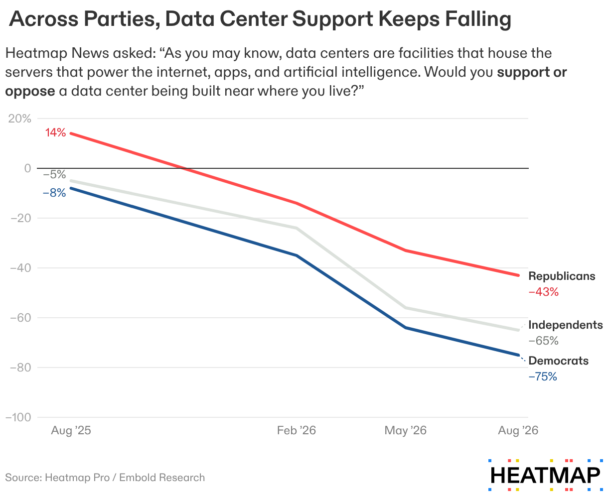
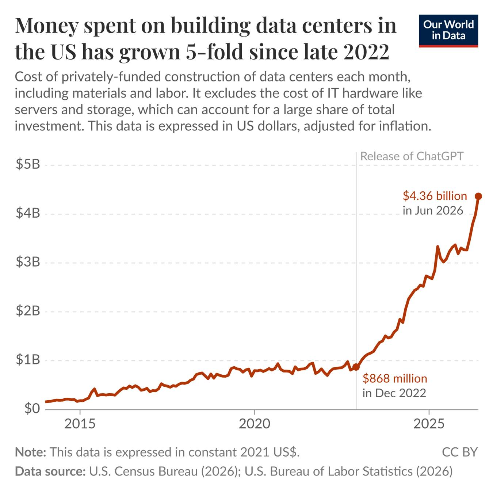
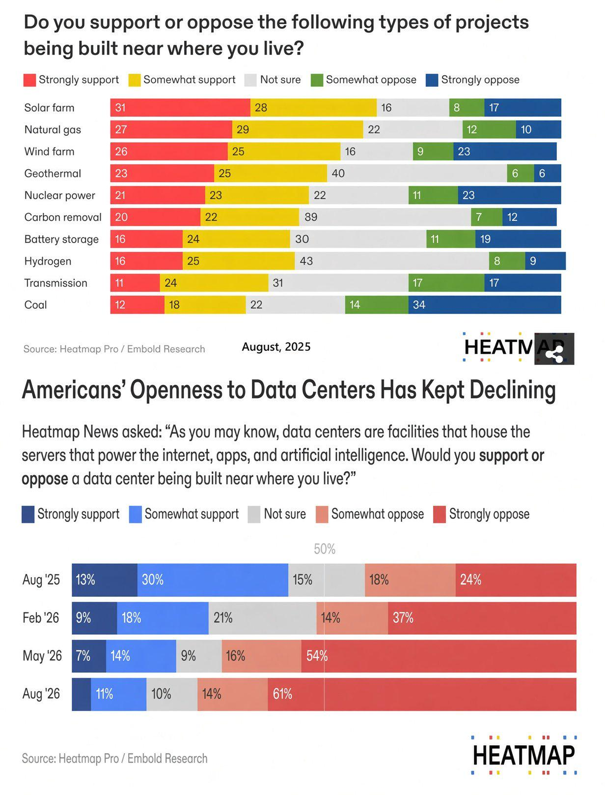

A recent [poll](https://heatmap.news/daily/data-center-opposition-poll-collapse) conducted by Embold Research found that
75% of Americans now oppose building data centers in their areas, including 61% voicing strong opposition. This finding carries
across party lines, and opposition is quickly increasing with time.

{#fig-support width=50%}

Users on Twitter posted furiously over the weekend in defence of data centers. All of the arguments I
read in support of data centers strike me as very unconvincing, and ultimately I think people are going to have a very hard time
building support for them if this is the level they are operating at.
The arguments seem to break into these few main categories:

- ***"This will be great for jobs and local economy..."***
  - While the 1-2 year construction phase of a data center might create 1000-1500 temporary construction jobs, afterwards we're looking
  at ~50 permanent jobs. For something that costs billions of dollars, this doesn't really seem like a lot of permanent jobs. 
  - These kinds of facilities also seem to get incredible amounts of subsidies, tax breaks, and discounted energy rates. [A report](https://gothamist.com/news/ny-subsidies-for-rockland-county-data-centers-top-320m-report-says) 
  from the watchdog group Reinvent Albany notes that the New York Power Authority supplied power to data centers in Rockland County 
  at a rate of $12.88/MWh while the average New York household pays $244/MWh.
  - People are keenly aware of the kind of deals that these facilities get, and without the permanent jobs behind them, the local economic
  argument does not seem to resonate.

- ***"If you don't like data centers, don't use the internet..."***
  - A common refrain seems to be that if people are opposed to data centers, then they should avoid the internet altogether. After all,
  all their favourite apps - DoorDash, Twitter, online banking, Netflix, etc. - all use data centers in some way, and it 
  is therefore hypocritical to use the internet at all. This strikes me as a 
  very disingenuous argument, and assumes people are stupid. 
  We've had all these things for years and years, while there has been a recent proliferation in data center construction that
  has been clearly driven by AI. Shifting the argument like this makes it seem like you are unwilling to defend AI,
  the thing that the data centers you want to defend are being built for.

  {#fig-spend width=50%}

- ***"If we don't do this, we'll fall behind China..."***
  - I honestly think this kind of sinophobic propaganda isn't very effective any more. People are seeing China build mass transit,
  housing, and the kind of hyper-modern cities they dreamed of as children. Maybe people are okay with them leading the AI revolution.
  After seeing how American tech has evolved in the last 15 years, I think it's reasonable for people to assume that more AI built in 
  America will just lead to them being more heavily surveilled and price-gouged.

- ***"Your environmental concerns are completely unfounded..."***
  - Even if we were to grant that all the concerns about water usage or pollution contribution are completely unfounded, 
  I don't think people are convinced. 
  - I think people have both local and global concerns, so let's try to split them up.
  - At the local level, for example, it's easy to see [news reports](https://www.youtube.com/watch?v=gc5XZJfF0kQ) 
  about how a community with a data center is experiencing awful constant noise. How is this going to affect their quality of life,
  their property values, the local wildlife? I don't think they are getting any clear answers on this. What about the effect that 
  the new excessive power demand is going to have on their power bills?
  - At the global level, data centers consume ~2.5% of global electricity and this is expected to double in the next few years. While
  this isn't necessarily a huge impact alone, people are left to ask if this is something we really need to be doing at a time when we 
  drastically need to reduce emissions to curb climate change.
  - Ultimately, I think people are willing to take on environmental harm when they see a clear benefit. Construction of a nearby coal
  power plant has almost double the support of a data center. I think this is because people ultimately see some benefit - energy generation,
  and blue-collar jobs. What benefit do they see from AI?

  {#fig-coal width=50%}

- ***"All the negativity against data centers is a Chinese psy-op"***
  - Even if that were true, you are still going to have to convince people, and simply saying they have been "psy-opped" isn't going to do so.

- ***"AI is going to destroy all the jobs and create a permanent underclass"***
  - Since we've established that data center proliferation is the same as AI proliferation, we can now talk about whether AI is good
  for people or not. 
  People constantly hear this kind of rhetoric about how AI will take all the jobs and 
  create a permanent underclass, not only from tech-bros, but also from the AI CEOs trying to promote the technology.
  Those CEOs are also constantly talking about how there's a decent chance that some kind of super-intelligent AI will cause human extinction
  and we will be completely powerless to stop it. While the latter is easily read as a marketing gimmick, I think people really do clue
  in to the idea that AI is coming for their jobs. It's the obvious reason why there is so much money behind AI - your boss replacing your
  job with an AI that costs a fraction of your salary is great for your boss and for the AI company, and terrible for you. We live in a
  society where the social contract essentially says you only get to live a tolerable life if you have a job, so it's obvious that people
  will try to resist wherever they can to keep their jobs. No one wants to sign up to be part of a permanent underclass. 
  - It's common for some people to argue that AI is just a fun little tool that can make little images, or write a song, or help you code. 
  Why all the concern when it's so benign? But again, people know that the cat is out of the bag - the vast amount of money behind AI is there because of the possibility that it will 
  eliminate many jobs in the future; all the fun little tools are second order.

- ***"Just like the industrial revolution, there will be new jobs"***
  - This is a common refrain we hear from people who are trying to quell the fears of job loss. However, we never hear any specificity about
  what these new jobs will be, how well they will pay, how secure they will be, etc. But to me the better question is this - if the AI is good
  enough to take your existing job, why should I expect that it won't soon become good enough to replace this hypothetical new job? That's 
  ultimately what the goal of AI is - doing tasks as well, or better, than humans. If there is a new task that cannot ever be done by 
  AI, then doesn't that mean the AI has failed?

- ***"Embrace the job loss, there will be UBI and shared riches"***
  - Another common refrain we hear from people who are trying to quell the fears of job loss is that actually this will be good because
  working sucks, and you will now be free to use your time fully as you see fit. This will be enabled by some kind of Universal Basic Income (UBI)
  funded by the gains of AI. Elon Musk, for example, is always tweeting about how AI will bring about "Universal High Income". This all sounds
  great, but it leaves out the part of how we actually get there. Are these AI companies going to voluntarily give up their riches?
  Is the government going to force them to? I think people have good reasons to doubt that this will happen! 
  It is always very suspicious when the greediest people in history who constantly lie start talking like Marxists. 
  The other option, I suppose,
  is violent class war, but I don't think your average person wants to sign up as a guerrilla fighter against what would hypothetically
  be the most powerful entity in human history.

- ***"AI is inevitable, so just relent now please"***
  - I don't think this is a very strong argument, and it reads more as bullying. 
  These systems are not bound by physical law, and nothing is inevitable if we collectively
  decide to stop it.

- ***"AI is curing cancer"***
  - The final point of the argument acknowledges that a lot of people rightly have existential concerns about the 
  proliferation of data centers and thus AI, but argues that the amount of good that AI will do should greatly outweigh these concerns,
  and that we should be grateful for data centers. "AI is curing cancer" is a common talking point right now, with the implicit
  point being that curing cancer would indeed be a sufficient good to outweigh people's concerns. These claims seem to be
  resting solely on the [recent news](https://www.cbc.ca/news/health/mrna-melanoma-cancer-vaccine-trial-9.7312277) 
  that Moderna and Merck are making solid progress towards completing a phase 3 trial for a new skin cancer treatment
  that combines immunotherapy and mRNA vaccine technology. The news sent Moderna's stock skyrocketing, and a headline that went
  around was that "AI played a key role in designing the vaccine". But what does that actually mean? This work started development in 
  2017, long before ChatGPT existed. In fact, they use a machine learning pipeline to help with the per-patient bespoke workflow (see 
  [here](https://www.davidborish.com/post/the-algorithm-inside-moderna-s-cancer-vaccine-and-the-pharma-ai-race-it-reframes) for a 
  nice overview). But this is the kind of machine learning algorithm that existed before LLMs, and doesn't require a massive proliferation
  of data centers to exist - it's very dishonest to conflate the two.
  - Now LLM-style AIs have been making incredible progress in one intellectual area in particular - mathematics. They work great in the
  formal, structured environment that math provides, especially with the recent advent of proof formalization with Lean. 
  Many novel proofs, improvements, and counter-examples have been constructed recently.
  However, I think it would be a hard sell to convince the average person that [disproving the Erdős unit distance conjecture](https://cdn.openai.com/pdf/74c24085-19b0-4534-9c90-465b8e29ad73/unit-distance-proof.pdf)
  should make them happy about losing their job!

