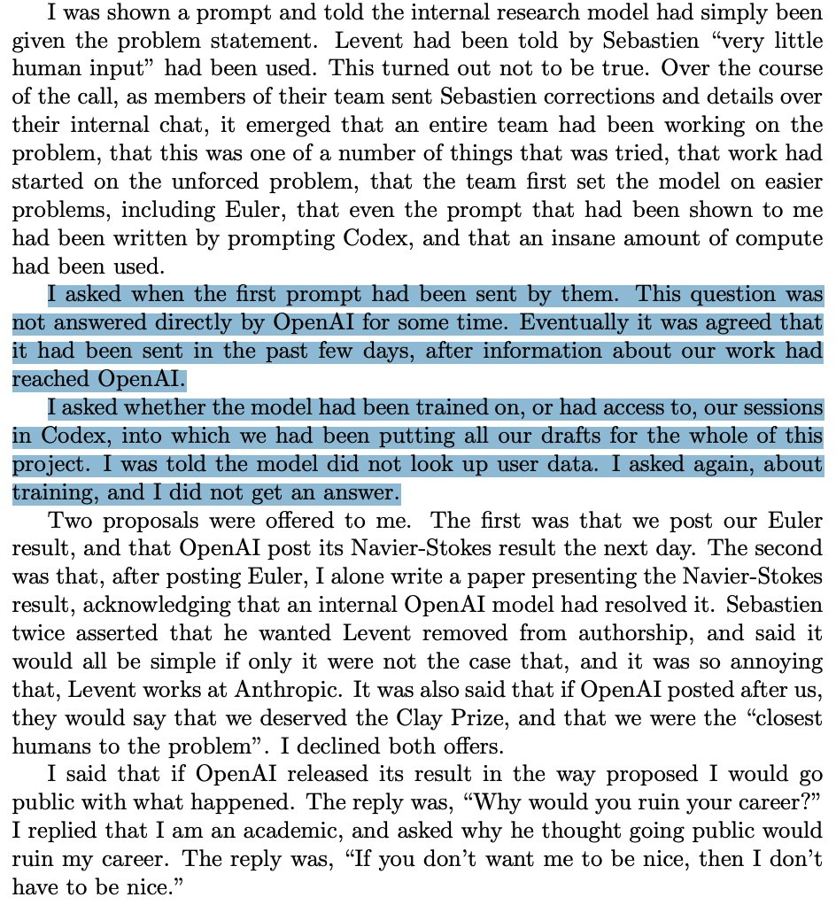

It was announced today by [OpenAI](https://openai.com/index/navier-stokes-solution/) that they are sharing a solution to
the Navier-Stokes problem. The [Millennium Prize Problems](https://en.wikipedia.org/wiki/Millennium_Prize_Problems) are seven complex mathematical problems, selected in the year 2000, with each 
one representing a prize of one million US dollars to the first correct solution. The first prize was awarded in 2010 to Grigori Perelman
for his proof of the Poincaré conjecture, although he chose to decline the prize money. The Navier-Stokes existence and smoothness problem,
asks about the properties of the Navier-Stokes equations, which are essentially the governing equations of fluid mechanics. The full
paper has been posted [here](https://drive.google.com/file/d/10Ebaa__Aa_g4E7NEDnLNTBRkFC2EombH/view). Now, I'm in no position to give any useful or interesting feedback on this result. But I'm more interested in talking about the 
apparent way in which the result came about.

[The claims going around are](https://x.com/konstiwohlwend/status/2097235335034056835) that Tristan Buckmaster (NYU) and Levent Alpöge (Anthropic) had been making strides towards solving the problem themselves, 
and using codex to help their research. After word of their work reached OpenAI, an internal team was set on the problem with an "insane amount of compute", by OpenAI's own account.
Buckmaster and Alpöge had been putting all of their drafts into Codex, and when Buckmaster asked whether the model had been trained on
those sessions, he didn't get an answer. OpenAI then offered him two deals: post their result and let OpenAI follow with
Navier-Stokes the next day, or write up the Navier-Stokes result himself, crediting an internal OpenAI model, on the condition that
Alpöge, who works at Anthropic, be removed from authorship. In exchange, OpenAI would say publicly that the pair "deserved the Clay Prize".
He declined both. When he said he'd go public, the reply was "Why would you ruin your career?" and, later, "If you don't want me to be
nice, then I don't have to be nice." Obviously, there's a lot to read into here.

{#fig-explanation width=50%}

Now if that is indeed an accurate version of what happened, the implications are profound. Imagine that every time a researcher is making
big progress on an important problem, a big AI company takes notice of it and uses their work to push it foward with their 
much larger computational capability and take credit 
themselves. That could be the reality we are heading towards. In that case, is it time for university departments to start hosting 
their own private language models whose data privacy they can control? Are researchers going to have to 
start being a lot more secretive about their work, when academia is very much based around collaboration?
There's a lot to think about here. 

